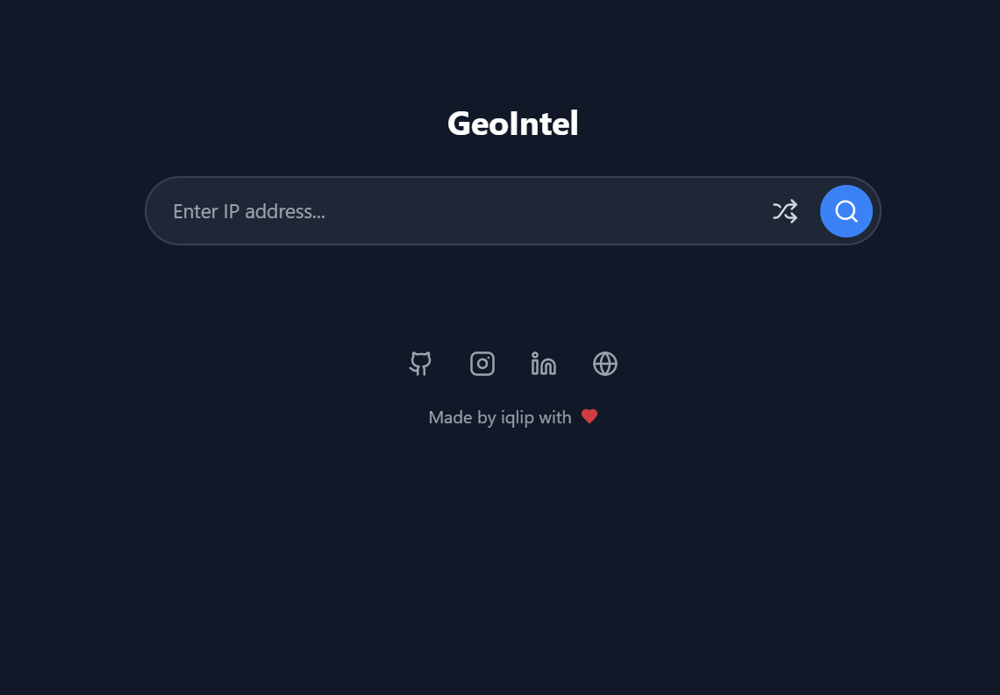

# GeoIntel 🗺️  

**GeoIntel** is a web-based IP lookup tool that provides detailed geographical insights about an IP address. It fetches real-time data, including country, city, ISP, and coordinates, using IP-API. Built for efficiency, it features a sleek UI with dark mode support.  

## Features ✨  

- **Try a Random IP**: Quickly test geolocation data with a random IP lookup.  
- **Dark Mode**: Comfortable viewing experience in low-light environments.  
- **Interactive Map**: Integrated with **OpenStreetMap** for real-time visualization.  
- **Google Maps Link**: Get more detailed location insights with a direct link.  
- **Real-Time Search**: Responsive, user-friendly interface for instant results.  

## Prerequisites ✅  

Ensure you have the following before running GeoIntel:  

- **Docker** installed ([Get Docker](https://docs.docker.com/get-docker/))  
- **An active internet connection** (for fetching IP geolocation data)  

## Quick Start 🚀  

To pull and run GeoIntel using Docker, execute:  

```bash
docker pull iqlip/geointel:latest
```

```bash
sudo docker run -p 4173:4173 iqlip/geointel:latest
```

Once the container is running, open your browser and visit:  

```
http://localhost:4173
```

## Screenshots




## Credits

This project uses the following services:

- [IP-API](https://ip-api.com/) for IP geolocation data.
- [OpenStreetMap](https://www.openstreetmap.org/) for mapping and visualization.

A huge thanks to these services for providing free and valuable APIs! 🙌


## Socials & Contact 🌍
GitHub: https://github.com/iqlipx

Portfolio: https://iqlip.vercel.app

